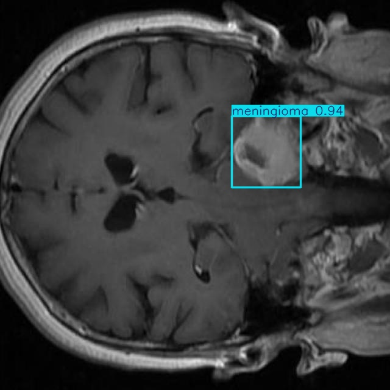

<!-- # NeuroLens - MRI Brain Tumor Detection & Segmentation Pipeline 


---

## 🚀 Overview

An end-to-end deep learning solution for automated brain tumor detection and segmentation in MRI scans, developed during my research internship at **DRDO-INMAS**.

This project accelerates radiological workflows using 2D/3D MRI datasets and scalable AI pipelines. The pipeline includes detection (**YOLOv8**), 3D U-Net segmentation, and visualization via **Streamlit**.

---

## 🏗️ Architecture


---

## 📦 BraTS2020 Dataset Overview

- **Gold standard** for brain tumor segmentation (MICCAI BraTS challenge)
- **369** multi-institutional 3D MRI volumes (T1, T1ce, T2, FLAIR)
- **Expert-annotated** masks: necrotic core, edema, enhancing tumor
- **240×240×155** voxels, 1mm³ isotropic, skull-stripped, co-registered
- Used for **training, validation, and benchmarking** of segmentation models

---

## YOLOv8 for Brain Tumor Detection

While the main focus of this project is on 3D U-Net-based segmentation using the BraTS dataset, we also explored **YOLOv8** for fast tumor detection on 2D MRI slices. YOLOv8 enables rapid localization of tumor regions, which can be useful for pre-screening or as a first step before detailed segmentation.

- **Model:** YOLOv8 (PyTorch, Ultralytics)
- **Reference Dataset:** [Medical Image Dataset: Brain Tumor Detection (Kaggle)](https://www.kaggle.com/datasets/pkdarabi/medical-image-dataset-brain-tumor-detection)
- **Classes:** Glioma, Meningioma, Pituitary
- **Pipeline:** Data preparation, YOLOv8 training, evaluation (mAP, precision, recall), and batch inference on test images.
- **Notebook:** [`notebooks/yolov8-brain-tumor-detection.ipynb`](notebooks/yolov8-brain-tumor-detection.ipynb)

**Key Features:**
- Fast detection of tumor types in 2D MRI slices.
- Useful for rapid triage and as a pre-processing step for 3D segmentation.
- Visualizations of detection results and training metrics included.

---

## 3D U-Net for Tumor Segmentation

The core of this project is a 3D U-Net model trained on the BraTS2020 dataset for voxel-wise segmentation of brain tumor subregions.

- **Model:** 3D U-Net (Keras/TensorFlow)
- **Dataset:** BraTS2020 (multi-modal 3D MRI)
- **Pipeline:** Preprocessing, model training, evaluation, and inference.
- **Notebook:** [`notebooks/u-net-brain-tumor-segmentation.ipynb`](notebooks/u-net-brain-tumor-segmentation.ipynb)

**Key Features:**
- Multi-class segmentation: necrotic core, edema, enhancing tumor.
- High Dice scores on all tumor regions.
- Streamlit app for interactive inference and visualization.

---

## 📊 Key Metrics (BraTS2020 & Pipeline)

| Task           | Metric                | Value      |
|----------------|----------------------|------------|
| Detection      | mAP@50                | 91.4%      |
| Detection      | Precision             | 90.8%      |
| Detection      | Recall                | 86.5%      |
| Segmentation   | Dice Score (mean)     | 0.98       |
| Region-wise    | Dice (Enhancing Tumor)| 0.79       |
| Region-wise    | Dice (Tumor Core)     | 0.83       |
| Region-wise    | Dice (Whole Tumor)    | 0.87       |

---

## Usage

All model training and experiments were conducted on **Kaggle Notebooks** for GPU acceleration and easy dataset access.

1. **Open the notebooks directly on Kaggle:**

   - **3D U-Net Segmentation:**  
     [u-net-brain-tumor-segmentation.ipynb](notebooks/u-net-brain-tumor-segmentation.ipynb)
   - **YOLOv8 Detection:**  
     [yolov8-brain-tumor-detection.ipynb](notebooks/yolov8-brain-tumor-detection.ipynb)

2. **To run locally (optional):**
   - Download the notebooks and datasets from Kaggle.
   - Create and activate a conda environment:
     ```bash
     conda create -n brats python=3.8 -y
     conda activate brats
     ```
   - Install dependencies:
     ```bash
     pip install -r requirements.txt
     ```
   - Launch Jupyter Notebook:
     ```bash
     jupyter notebook notebooks/u-net-brain-tumor-segmentation.ipynb
     jupyter notebook notebooks/yolov8-brain-tumor-detection.ipynb
     ```

> **Note:** For best results and GPU support, use [Kaggle Notebooks](https://www.kaggle.com/code) with the provided datasets.


---

## References

- [BraTS 2020 Dataset](https://www.kaggle.com/datasets/awsaf49/brats20-dataset-training-validation)
- [Medical Image Dataset: Brain Tumor Detection (YOLOv8)](https://www.kaggle.com/datasets/pkdarabi/medical-image-dataset-brain-tumor-detection) -->


# NeuroLens - MRI Brain Tumor Detection & Segmentation Pipeline 


---

## Overview

An end-to-end deep learning solution for automated brain tumor detection and segmentation in MRI scans, developed during my research internship at **DRDO-INMAS**.

This project accelerates radiological workflows using 2D/3D MRI datasets and scalable AI pipelines. The pipeline includes detection (**YOLOv8**), 3D U-Net segmentation.

---

## Architecture


---

## BraTS2020 Dataset Overview

- **Gold standard** for brain tumor segmentation (MICCAI BraTS challenge)
- **369** multi-institutional 3D MRI volumes (T1, T1ce, T2, FLAIR)
- **Expert-annotated** masks: necrotic core, edema, enhancing tumor
- **240×240×155** voxels, 1mm³ isotropic, skull-stripped, co-registered
- Used for **training, validation, and benchmarking** of segmentation models

---

## YOLOv8 for Brain Tumor Detection

While the main focus of this project is on 3D U-Net-based segmentation using the BraTS dataset, we also explored **YOLOv8** for fast tumor detection on 2D MRI slices. YOLOv8 enables rapid localization of tumor regions, which can be useful for pre-screening or as a first step before detailed segmentation.

- **Model:** YOLOv8 (PyTorch, Ultralytics)
- **Reference Dataset:** [Medical Image Dataset: Brain Tumor Detection (Kaggle)](https://www.kaggle.com/datasets/pkdarabi/medical-image-dataset-brain-tumor-detection)
- **Classes:** Glioma, Meningioma, Pituitary
- **Pipeline:** Data preparation, YOLOv8 training, evaluation (mAP, precision, recall), and batch inference on test images.
- **Notebook:** [`notebooks/yolov8-brain-tumor-detection.ipynb`](notebooks/yolov8-brain-tumor-detection.ipynb)

**Key Features:**
- Fast detection of tumor types in 2D MRI slices.
- Useful for rapid triage and as a pre-processing step for 3D segmentation.
- Visualizations of detection results and training metrics included.

---

## 3D U-Net for Tumor Segmentation

The core of this project is a 3D U-Net model trained on the BraTS2020 dataset for voxel-wise segmentation of brain tumor subregions.

- **Model:** 3D U-Net (Keras/TensorFlow)
- **Dataset:** BraTS2020 (multi-modal 3D MRI)
- **Pipeline:** Preprocessing, model training, evaluation, and inference.
- **Notebook:** [`notebooks/u-net-brain-tumor-segmentation.ipynb`](notebooks/u-net-brain-tumor-segmentation.ipynb)

**Key Features:**
- Multi-class segmentation: necrotic core, edema, enhancing tumor.
- High Dice scores on all tumor regions.
- Streamlit app for interactive inference and visualization.

---

## Predictions & Results

### YOLOv8 Detection Results

| Glioma | No Tumor | Meningioma | Pituitary |
|:--------------:|:---------------:|:------------------:|:----------------:|
|  |  |  |  |

---

### 3D U-Net Segmentation Result (BraTS2020)

| U-Net Segmentation |
|:-------------------------:|
|  |

---

## Key Metrics (BraTS2020 & Pipeline)

| Task           | Metric                | Value      |
|----------------|----------------------|------------|
| Detection      | mAP@50                | 91.4%      |
| Detection      | Precision             | 90.8%      |
| Detection      | Recall                | 86.5%      |
| Segmentation   | Dice Score (mean)     | 0.98       |
| Region-wise    | Dice (Enhancing Tumor)| 0.79       |
| Region-wise    | Dice (Tumor Core)     | 0.83       |
| Region-wise    | Dice (Whole Tumor)    | 0.87       |

---

## Usage

All model training and experiments were conducted on **Kaggle Notebooks** for GPU acceleration and easy dataset access.

1. **Open the notebooks directly on Kaggle:**

   - **3D U-Net Segmentation:**  
     [u-net-brain-tumor-segmentation.ipynb](notebooks/u-net-brain-tumor-segmentation.ipynb)
   - **YOLOv8 Detection:**  
     [yolov8-brain-tumor-detection.ipynb](notebooks/yolov8-brain-tumor-detection.ipynb)

2. **To run locally (optional):**
   - Download the notebooks and datasets from Kaggle.
   - Create and activate a conda environment:
     ```bash
     conda create -n brats python=3.8 -y
     conda activate brats
     ```
   - Install dependencies:
     ```bash
     pip install -r requirements.txt
     ```
   - Launch Jupyter Notebook:
     ```bash
     jupyter notebook notebooks/u-net-brain-tumor-segmentation.ipynb
     jupyter notebook notebooks/yolov8-brain-tumor-detection.ipynb
     ```

> **Note:** For best results and GPU support, use [Kaggle Notebooks](https://www.kaggle.com/code) with the provided datasets.

---

## References

- [BraTS 2020 Dataset](https://www.kaggle.com/datasets/awsaf49/brats20-dataset-training-validation)
- [Medical Image Dataset: Brain Tumor Detection (YOLOv8)](https://www.kaggle.com/datasets/pkdarabi/medical-image-dataset-brain-tumor-detection)